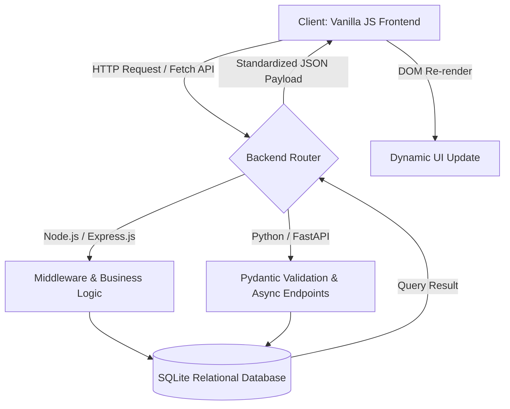

# ⚡ Student Manager REST API — Dual-Ecosystem Architecture

[](https://nodejs.org/)
[](https://fastapi.tiangolo.com/)
[](https://www.sqlite.org/)
[](https://opensource.org/licenses/MIT)

A production-grade, full-stack REST API demonstrating cross-platform API parity, decoupled client-server architecture, and side-by-side dual-backend runtime evaluation.

---

## 📑 Table of Contents

1. [Overview & Engineering Objectives](#-overview--engineering-objectives)
2. [System Architecture & Data Flow](#-system-architecture--data-flow)
3. [Cross-Ecosystem Comparison: Express.js vs. FastAPI](#-cross-ecosystem-comparison-expressjs-vs-fastapi)
4. [API Specification & Payloads](#-api-specification--payloads)
5. [Repository Directory Structure](#-repository-directory-structure)
6. [Quickstart & Local Installation](#-quickstart--local-installation)
7. [Testing Guide (cURL & Postman)](#-testing-guide-curl--postman)
8. [Roadmap & Production Scaling](#-roadmap--production-scaling)
9. [Acknowledgments](#-acknowledgments)

---

## 🌟 Overview & Engineering Objectives

The **Student Manager REST API** is a systems-level exploration of building robust web services. Rather than relying on a single stack, this repository implements **identical, production-ready API contracts across two distinct runtime ecosystems**:

- **Node.js with Express.js** — single-threaded event loop, minimal middleware paradigm.
- **Python with FastAPI** — asynchronous ASGI execution, automatic Pydantic schema validation, and built-in Swagger documentation.

Developed under the technical guidance of **Aryan Tripathi**, this project connects core API design principles — statelessness, idempotency, and correct HTTP status code handling — with real-world client-server integration.

---

## 🏛️ System Architecture & Data Flow

The system uses a fully decoupled client-server architecture. The frontend communicates with the backend strictly through asynchronous, JSON-based HTTP requests.



### Request Lifecycle

1. **User Interaction** — the client triggers an event (e.g. submitting a student form or requesting records).
2. **Transport Layer** — the frontend dispatches an asynchronous HTTP request (`GET`, `POST`, `PUT`, `PATCH`, `DELETE`) via the Fetch API.
3. **Server Validation** — the backend validates the payload's structural integrity and runs core business logic.
4. **Persistence** — the query executes against a lightweight SQLite relational database.
5. **Response** — a standardized JSON response with precise HTTP status codes (`200`, `201`, `400`, `404`) is returned, triggering an immediate UI update.

---

## ⚖️ Cross-Ecosystem Comparison: Express.js vs. FastAPI

A core objective of this repository is evaluating how different architectural patterns affect performance, developer velocity, and runtime safety:

| Architectural Dimension | Node.js (Express.js) | Python (FastAPI) |
| :--- | :--- | :--- |
| **Language Runtime** | V8 engine (JavaScript, TypeScript-ready) | CPython (Python 3.10+, ASGI / Uvicorn) |
| **Concurrency Model** | Single-threaded event loop, non-blocking I/O | Native asynchronous execution (`async`/`await`) |
| **Data Validation** | Manual middleware checks or third-party packages | Automatic runtime validation via Pydantic type hints |
| **API Documentation** | Manual setup (Postman collections or Swagger UI) | Built-in interactive Swagger UI (`/docs`) & ReDoc (`/redoc`) |
| **Type Safety** | Dynamic — requires JSDoc or TypeScript | Strict static type hinting enforced at runtime |

---

## 🔌 API Specification & Payloads

All endpoints follow REST conventions, using resource-oriented URLs and standard HTTP methods.

| Method | Endpoint | Description | Success Status |
| :--- | :--- | :--- | :--- |
| **GET** | `/api/students` | Retrieve all registered students | `200 OK` |
| **GET** | `/api/students/:id` | Retrieve a single student by ID | `200 OK` / `404 Not Found` |
| **POST** | `/api/students` | Create a new student record | `201 Created` / `400 Bad Request` |
| **PUT** | `/api/students/:id` | Replace an existing student record | `200 OK` / `400` / `404` |
| **PATCH** | `/api/students/:id` | Partially update a student record | `200 OK` / `404 Not Found` |
| **DELETE** | `/api/students/:id` | Remove a student record | `200 OK` / `404 Not Found` |

### Sample Request — `POST /api/students`

```json
{
  "name": "Jane Doe",
  "email": "jane.doe@example.com",
  "age": 21,
  "course": "Cloud Computing & AI Infrastructure"
}
```

### Sample Response — `201 Created`

```json
{
  "success": true,
  "status": 201,
  "message": "Student record successfully created.",
  "data": {
    "id": 14,
    "name": "Jane Doe",
    "email": "jane.doe@example.com",
    "age": 21,
    "course": "Cloud Computing & AI Infrastructure",
    "created_at": "2026-06-06T10:30:00Z"
  }
}
```

---

## 📂 Repository Directory Structure

```text
RESTAPI/
├── frontend/
│   ├── index.html        # Main dashboard UI
│   ├── style.css         # Responsive styling
│   └── app.js             # Fetch API client integration logic
├── js-backend/
│   ├── server.js          # Express app entry point
│   ├── routes/             # Express router endpoints
│   ├── package.json        # Node dependencies
│   └── database.sqlite     # SQLite file database
├── python-backend/
│   ├── main.py             # FastAPI application & router config
│   ├── models.py           # Pydantic schemas & database models
│   ├── requirements.txt    # Python pip dependencies
│   └── database.db         # SQLite file database
└── README.md                # Project documentation
```

---

## 🚀 Quickstart & Local Installation

### Prerequisites

- **Node.js** (v18+ recommended)
- **Python** (v3.10+ recommended)
- **Git**

### Step 1: Clone the Repository

```bash
git clone https://github.com/YOUR_USERNAME/RESTAPI.git
cd RESTAPI
```

### Step 2: Initialize a Backend

Choose **one** of the two backend implementations to run:

**Option A — Node.js / Express**

```bash
cd js-backend
npm install
npm start
# Server runs on http://localhost:3000
```

**Option B — Python / FastAPI**

```bash
cd python-backend
pip install -r requirements.txt
python main.py
# Server runs on http://localhost:8000 (interactive docs at /docs)
```

### Step 3: Launch the Frontend

Open `frontend/index.html` directly in your browser, or serve it with a local static server (e.g. VS Code's Live Server extension).

---

## 🧪 Testing Guide (cURL & Postman)

Verify your server instance using standard command-line tools:

```bash
# Fetch all student records
curl -X GET http://localhost:3000/api/students

# Create a new student record
curl -X POST http://localhost:3000/api/students \
  -H "Content-Type: application/json" \
  -d '{"name": "Alex Smith", "email": "alex@example.com", "age": 22, "course": "Generative AI"}'
```

---

## 🗺️ Roadmap & Production Scaling

- [ ] **Authentication & Security** — implement stateless JWT-based authorization middleware.
- [ ] **Containerization** — author multi-stage `Dockerfile` configurations and `docker-compose.yml` for unified deployment.
- [ ] **Database Migration** — scale the storage layer from SQLite to PostgreSQL/MongoDB with connection pooling.
- [ ] **Automated Testing** — build an integration test suite using Jest (Node) and PyTest (Python).

---

## 🙏 Acknowledgments

Special thanks to **Aryan Tripathi** for technical mentorship, code review, and instilling a hands-on, systems-level approach to API engineering.

---

## 📄 License

Distributed under the MIT License. See `LICENSE` for details.
